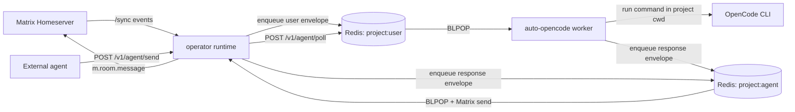

# Architecture

`operator` is a Matrix relay and worker runner. It receives Matrix room events, routes them through Redis queues, and sends responses back to Matrix either from auto-run OpenCode workers or external agents using HTTP.

## System Map

## End-to-End Request/Response Flow

1. Runtime bootstraps config, Redis clients, Matrix identity, HTTP facade, and worker loops (`src/index.ts`).
2. Inbound loop long-polls Matrix `/sync`, filters events, maps room -> project, and enqueues user envelopes to `project:user` (`src/runtime/loops.ts`, `src/runtime/matrix.ts`).
3. For auto-opencode projects, the project worker consumes `project:user`, enforces sender allowlist/dedup, and either:
   - executes `!op` project CLI commands (`usage`, `stats`, `models`, `model`, `start`), or
   - builds context and runs `opencode run` in the project working directory (`src/worker/auto-opencode.ts`, `src/runtime/process.ts`, `src/worker/context-state.ts`).
4. Worker output is written to `project:agent` as queue envelopes.
5. Outbound loop consumes `project:agent`, renders Matrix message content (plain/markdown -> HTML), and sends `m.room.message` to the configured room (`src/runtime/loops.ts`, `src/runtime/matrix.ts`).

## Relay HTTP Endpoints

Relay HTTP is served by `src/runtime/http.ts`:

- `GET /health` and `GET /v1/health`: liveness and auth-config status.
- `GET /v1/metrics`: queue depth and in-process operational metrics.
- `POST /v1/agent/poll`: external agent consumes user work from `project:user`.
- `POST /v1/agent/send`: external agent publishes responses to `project:agent`.

Authentication for `/v1/agent/*` is Bearer token based (`agentApiToken`/`agentApiTokens` or `AGENT_API_TOKEN(S)`).

## Core Data + Control Boundaries

- **Matrix boundary**: only Matrix HTTP APIs are used (`/_matrix/client/v3/*`) for sync/join/send.
- **Queue boundary**: all cross-component message passing uses Redis list queues with JSON envelopes (`src/runtime/redis.ts`).
- **Execution boundary**: OpenCode runs as a child process with timeout/abort controls and stream parsing (`src/runtime/process.ts`).
- **Project isolation boundary**: per-project queue keys, working directory, model override, and sender allowlist are enforced from config.
- **State boundary**: per-project worker state is stored under `.operator-state/<project>/<agent>/` (inbox/outbox logs, rolling summary, current context).

## External Dependencies

- **Matrix homeserver**: source of inbound room events and sink for outbound messages.
- **Redis**: durable queue transport (`project:user`, `project:agent`) plus sync token storage.
- **OpenCode CLI**: executes autonomous coding tasks for auto-opencode projects.
- **Bun runtime**: hosts HTTP server, Redis client, and long-running loops.

## Runtime Components

- `src/runtime/config.ts`: config parsing/loading, room/project mapping, config persistence for management commands.
- `src/runtime/redis.ts`: Redis connectivity, queue key naming, envelope encode/decode.
- `src/runtime/matrix.ts`: Matrix API client helpers and event/content transformations.
- `src/runtime/loops.ts`: inbound `/sync` ingestion and outbound queue-to-Matrix delivery loops.
- `src/runtime/http.ts`: operator HTTP facade for health, metrics, and external agent APIs.
- `src/worker/auto-opencode.ts`: per-project worker + supervisor lifecycle.
- `src/runtime/process.ts`: process execution and OpenCode stream handling.
- `src/worker/context-state.ts`: rolling context files used to build each OpenCode prompt.
- `src/commands/management.ts` and `src/commands/opencode-cli.ts`: management-room and project-room command handlers.
