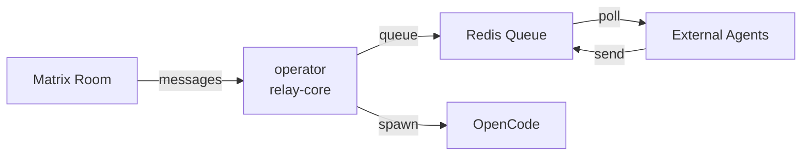

# operator

A Matrix-to-OpenCode bridge that lets you interact with OpenCode (AI coding assistant) directly from Matrix chat rooms.

## What It Is

`operator` is a relay service that:

- Connects to your Matrix homeserver and monitors configured rooms for messages
- Optionally runs OpenCode to respond to messages automatically using AI
- Provides an HTTP API for external agents to send/receive messages via Redis queues
- Supports in-room CLI commands for checking usage, models, and managing model overrides

## How It Works



1. **Matrix Ingress**: Messages from configured rooms are queued to Redis (`[project]:user`)
2. **Matrix Egress**: Agent responses from Redis (`[project]:agent`) are sent to rooms
3. **Auto OpenCode**: When enabled, automatically runs OpenCode to process user messages
4. **HTTP API**: External services can poll/send via `/v1/agent/poll` and `/v1/agent/send`

## Installation

### Prerequisites

- [Bun](https://bun.sh/) runtime
- Redis server
- Matrix homeserver account with access token
- OpenCode CLI (optional, for auto-response feature)

### Setup

1. Install dependencies:

```bash
bun install
```

2. Create your config file:

```bash
cp config.example.json config.json
```

3. Edit `config.json` with your settings:
   - `homeserverUrl`: Your Matrix server URL (e.g., `https://matrix.org`)
   - `accessToken`: Your Matrix access token (get from Element: Settings > Help & About > Advanced)
   - `adminUserIds`: List of Matrix user IDs allowed to trigger bot responses
   - `agentApiToken`: Secret token for HTTP API access
   - `redisUrl`: Redis connection URL

4. Configure projects (rooms the bot should monitor):

```json
{
  "projects": {
    "my-project": {
      "roomId": "!abc123:matrix.org",
      "projectWorkingDirectory": "/path/to/your/codebase",
      "senderAllowlist": ["@you:matrix.org"]
    }
  }
}
```

5. Run the daemon:

```bash
bun run src/index.ts
```

## In-Room Commands

You can use these commands directly in Matrix rooms:

| Command                           | Description                                  |
| --------------------------------- | -------------------------------------------- |
| `!op usage <model> [--days N]`    | Show usage stats for a specific model        |
| `!op stats [--days N] [--models]` | Show overall usage statistics                |
| `!op models [--verbose]`          | List available models                        |
| `!op model`                       | Show current model override for this project |
| `!op model <model-id>`            | Set a model override for this project        |
| `!op model reset`                 | Clear model override (use OpenCode default)  |
| `!op help`                        | Show command help                            |
| `stop`                            | Stop the active auto-opencode job            |

Example:

```
!op usage openai/gpt-5.3-codex --days 30
!op model openai/gpt-4-turbo
```

### Project Management Commands (Management Room Only)

Use these commands in your configured management room to add/remove/list projects.

| Command                                                   | Description                      |
| --------------------------------------------------------- | -------------------------------- |
| `!op list`                                                | Show all configured projects     |
| `!op create <name> --room <roomId> --path <dir>`         | Create a new project             |
| `!op delete <name>`                                       | Delete a project                 |
| `!op show <name>`                                         | Show one project configuration   |
| `!op reload`                                              | Reload `config.json` from disk   |
| `!op help`                                                | Show management command help     |

Examples:

```text
!op list
!op create operator --room !QefzZvtgPwIGrHuOuo:palantir --path /home/xangelo/repos/operator
!op show operator
!op reload
```

## HTTP API

The relay exposes an HTTP API for external agents:

### Health Check

```bash
curl http://localhost:8888/v1/health
```

### Poll for Messages

```bash
curl -X POST http://localhost:8888/v1/agent/poll \
  -H "Authorization: Bearer $AGENT_API_TOKEN" \
  -H "Content-Type: application/json" \
  -d '{"project":"my-project","agent":"bot","block_seconds":30}'
```

### Send a Message

```bash
curl -X POST http://localhost:8888/v1/agent/send \
  -H "Authorization: Bearer $AGENT_API_TOKEN" \
  -H "Content-Type: application/json" \
  -d '{"project":"my-project","agent":"bot","markdown":"Hello!","format":"markdown"}'
```

### Metrics

```bash
curl http://localhost:8888/v1/metrics
```

## Configuration Reference

### Top-Level Options

| Key             | Required | Description                                     |
| --------------- | -------- | ----------------------------------------------- |
| `port`          | No       | HTTP server port (default: 8888)                |
| `homeserverUrl` | Yes      | Matrix homeserver URL                           |
| `accessToken`   | Yes      | Matrix bot access token                         |
| `adminUserIds`  | No       | User IDs allowed to enqueue messages            |
| `agentApiToken` | No\*     | Token for HTTP API (\*required if using API)    |
| `redisUrl`      | No       | Redis URL (default: `redis://localhost:6379/0`) |

### Project Options

| Key                      | Required | Description                                                     |
| ------------------------ | -------- | --------------------------------------------------------------- |
| `roomId`                 | Yes      | Matrix room ID                                                  |
| `prefix`                 | No       | Legacy prefix for message routing                               |
| `agent`                  | No       | Agent label (default: `opencode`)                               |
| `command`                | No       | Command to run (default: `["opencode", "run"]`)                 |
| `commandPrefix`          | No       | In-room command prefix (default: `!op`)                         |
| `projectWorkingDirectory`| Yes      | Working directory for OpenCode                                  |
| `senderAllowlist`        | Yes      | Allowed senders                                                 |
| `timeoutSeconds`         | No       | Timeout for OpenCode runs (default: 300, 0=disable)             |
| `verbosity`              | No       | Output mode: `output`, `debug`, `thinking`, `thinking-complete` |

### Verbosity Modes

- `output`: Acknowledgment + final output only (default)
- `debug`: Full status stream + output
- `thinking`: Reasoning section titles + output
- `thinking-complete`: Full reasoning stream, suppress duplicate final output

## CLI Debug Commands

```bash
# Push agent message to queue
bun run src/index.ts push-agent my-project "Hello from CLI"

# Push user message to queue
bun run src/index.ts push-user my-project "Run tests" --sender @admin:matrix.org

# Poll user messages
bun run src/index.ts poll-user my-project --block 30
```

## Architecture Notes

- **Sync State**: Matrix sync position stored at Redis key `operator:sync:next-batch:v1`
- **Message Format**: Outbound messages support Markdown, converted to Matrix HTML
- **Security**: `command` runs with the process's permissions - treat as privileged config
- **Legacy**: `autoCodex*` and `autoOpenCode*` config keys are no longer supported

## Development

Run tests:

```bash
bun test
```

Type check:

```bash
bunx tsc --noEmit
```
